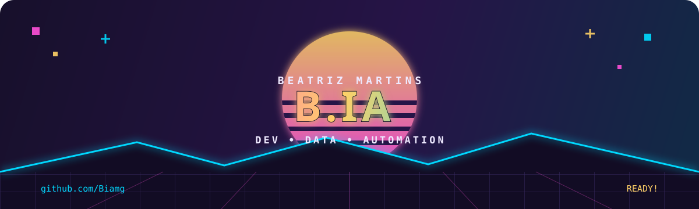

<div align="center">
  
</div>

<div align="center">
  <br />
  <strong>Transformando sistemas complexos em experiências mais simples.</strong>
  <br /><br />
  
  
</div>

### Oi, eu sou a B.ia! 👾

Sou desenvolvedora e gosto especialmente de projetos que pedem investigação, organização e uma boa dose de criatividade. Trabalho modernizando aplicações, conectando sistemas e transformando dados com **SQL** em experiências realmente úteis.

Hoje, meus interesses vivem na interseção entre **desenvolvimento backend**, **dados**, **automação** e **inteligência artificial**.

```text
MISSÃO ATUAL
├─ modernizar sistemas e portais
├─ construir integrações que façam sentido
├─ aproximar tecnologia e necessidades reais
└─ aprender alguma coisa nova no caminho ✦
```

### Certificações desbloqueadas 🏆

<div align="center">
  <a href="https://learn.microsoft.com/en-us/credentials/certifications/azure-virtual-desktop-specialty/">
    
  </a>
  <a href="https://learn.microsoft.com/en-us/credentials/certifications/fabric-analytics-engineer-associate/">
    
  </a>
  <br />
  <a href="https://learn.microsoft.com/en-us/credentials/certifications/power-platform-developer-associate/">
    
  </a>
  <a href="https://www.lpi.org/pt-br/our-certifications/lpic-1-overview/">
    
  </a>
</div>

<br />

| Credencial | Especialidade |
| :--- | :--- |
| **AZ-140** | Azure Virtual Desktop · infraestrutura, identidade e ambientes de usuário |
| **DP-600** | Microsoft Fabric · analytics, modelos semânticos, SQL, KQL e DAX |
| **PL-400** | Power Platform · desenvolvimento, integrações e automação |
| **LPIC-1** | Linux · linha de comando, administração, redes e segurança |

### Meu kit de ferramentas

<div align="center">
  
  <br /><br />
  
  
  
  
  
</div>

### Como eu gosto de trabalhar

**Investigar antes de assumir** — gosto de entender o problema por inteiro antes de escolher a solução.

**Simplificar sem perder qualidade** — código bom também precisa fazer sentido para quem vem depois.

**Evoluir a cada versão** — sempre há espaço para aprender, refinar e construir melhor.

<div align="center">
  <br />
  <sub>MINHAS CONTRIBUIÇÕES EM MODO ARCADE</sub>
  <br /><br />
  <picture>
    <source media="(prefers-color-scheme: dark)" srcset="https://raw.githubusercontent.com/Biamg/Biamg/output/github-contribution-grid-snake-dark.svg" />
    <source media="(prefers-color-scheme: light)" srcset="https://raw.githubusercontent.com/Biamg/Biamg/output/github-contribution-grid-snake.svg" />
    
  </picture>
  <br />
  <sub>cada quadrado conta uma parte da jornada</sub>
</div>
